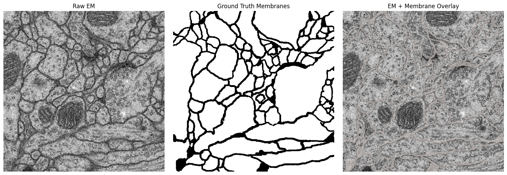
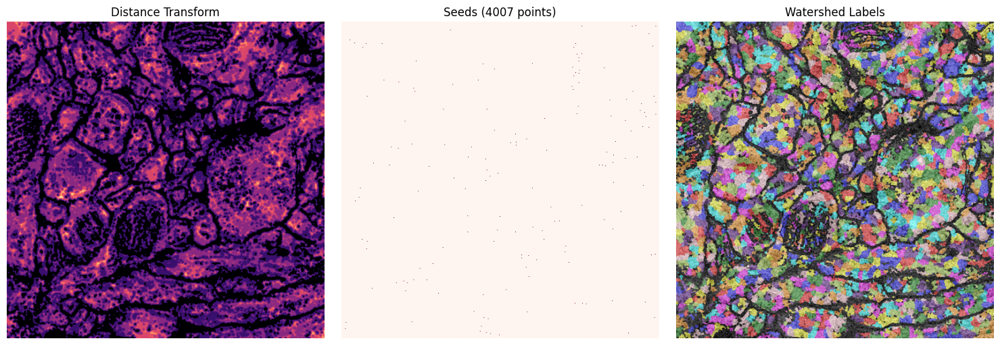
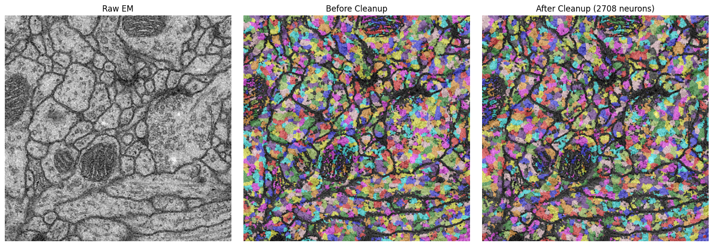
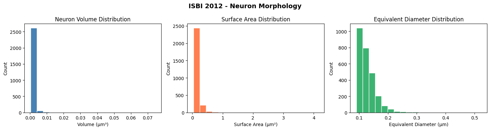
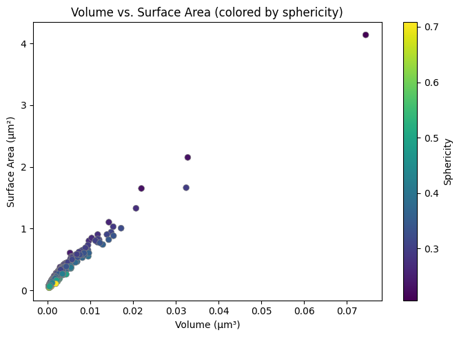
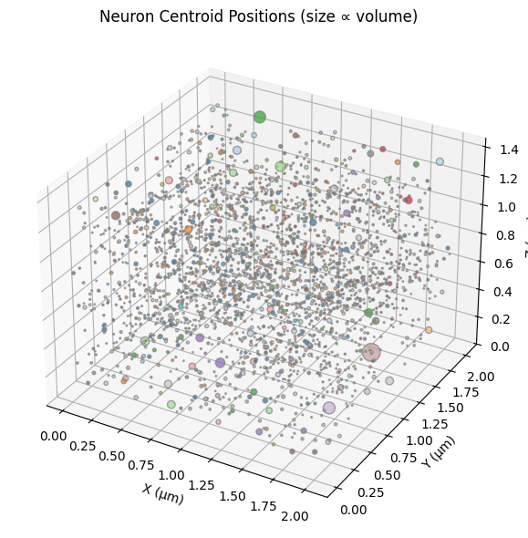

# slicer-connectomics-toolkit

**Neuron Segmentation and Connectomics Analysis with 3D Slicer**

By **Kevin Druciak**

---

An end-to-end toolkit I built for automated neuron segmentation from electron microscopy (EM) volumes, powered by [3D Slicer](https://www.slicer.org/). It includes a custom Slicer extension with a full GUI, command-line batch processing scripts, Jupyter notebooks for quantitative morphology analysis, and detailed project documentation.

## Results

All results below were generated from the [ISBI 2012](https://imagej.net/events/isbi-2012-segmentation-challenge) *Drosophila* serial-section TEM dataset (30 slices, 512x512, 4x4x50 nm).

### Raw EM Data with Ground Truth Membrane Overlay



### Segmentation Pipeline Output

Distance transform, watershed seeds, and labeled neuron segments produced by the pipeline:



### Final Segmentation

Raw EM alongside the segmentation before and after morphological cleanup:



### Neuron Morphology Analysis

Per-neuron volume, surface area, and equivalent diameter distributions:



Volume vs. surface area scatter colored by sphericity, and 3D centroid positions:

<p float="left">


</p>

---

## Background

I developed this toolkit during and after my studies at **Johns Hopkins University**, where I took coursework in connectomics that used 3D Slicer as the primary platform for volumetric image analysis. The courses covered EM-based neural circuit reconstruction, manual and semi-automated segmentation workflows, and quantitative morphology -- all within the Slicer ecosystem.

That hands-on experience motivated me to build a reusable, scriptable pipeline that automates the most labor-intensive parts of the connectomics workflow while staying fully integrated with Slicer's visualization and data management capabilities.

## What This Toolkit Does

| Capability | Implementation |
|---|---|
| **Interactive neuron segmentation** | Custom `NeuronSegmenter` Slicer extension with configurable preprocessing, membrane-based watershed, and morphological cleanup |
| **Batch processing** | CLI scripts that segment entire directories of EM stacks via `Slicer --python-script` |
| **Mesh export** | Per-neuron surface extraction as STL/OBJ using VTK marching cubes with Laplacian smoothing |
| **Quantitative metrics** | Volume, surface area, centroid, and sphericity computed per neuron and exported as CSV |
| **Atlas registration** | Rigid/affine alignment of EM volumes to a reference coordinate frame via BRAINSFit |
| **Morphology analysis** | Jupyter notebooks with distribution plots, volume-vs-surface-area scatter, and 3D centroid visualization |

## Segmentation Pipeline

The core algorithm I implemented follows this pipeline:

1. **Gaussian smoothing** -- reduces acquisition noise while preserving membrane boundaries
2. **Adaptive histogram equalization (CLAHE)** -- normalizes contrast across the volume
3. **Membrane detection** -- thresholds dark membrane regions in the EM intensity space
4. **Distance-transform seeded watershed** -- partitions cell interiors using local maxima of the distance map as seeds
5. **Connected-component relabeling** -- ensures each spatially disconnected region gets a unique ID (via `cc3d` for performance)
6. **Morphological cleanup** -- removes small fragments, fills interior holes, and optionally extracts neurite skeletons

## Repository Structure

```
slicer-connectomics-toolkit/
├── extension/NeuronSegmenter/       Custom 3D Slicer scripted module
│   ├── NeuronSegmenter.py           GUI panel and orchestration
│   ├── NeuronSegmenterLib/
│   │   ├── SegmentationLogic.py     Preprocessing, membrane detection, watershed
│   │   └── MorphologyUtils.py       Cleanup, hole filling, skeletonization
│   └── Testing/
│       └── test_segmentation.py     Unit tests (9 tests, no Slicer dependency)
│
├── scripts/
│   ├── batch_segment_em.py          Batch-process EM volumes
│   ├── export_neuron_meshes.py      Export neurons as STL/OBJ meshes
│   ├── compute_segment_stats.py     Per-neuron statistics to CSV
│   └── register_to_atlas.py         BRAINSFit registration wrapper
│
├── notebooks/
│   ├── 01_em_volume_exploration.ipynb
│   ├── 02_neuron_segmentation_pipeline.ipynb
│   └── 03_morphology_analysis.ipynb
│
├── tutorials/                       Project documentation
│   ├── 01_getting_started.md
│   ├── 02_manual_segmentation.md
│   ├── 03_automated_pipeline.md
│   └── 04_visualization_and_export.md
│
├── sample_data/isbi2012/            ISBI 2012 Drosophila ssTEM dataset
├── docs/                            Architecture diagrams and references
├── requirements.txt
└── LICENSE
```

## Technology Stack

| Component | Role |
|---|---|
| [3D Slicer](https://www.slicer.org/) | Visualization, segmentation, and registration platform |
| [VTK](https://vtk.org/) | Mesh generation (marching cubes) and 3D rendering |
| [ITK](https://itk.org/) | Image filtering and registration backends |
| [scikit-image](https://scikit-image.org/) | Watershed, morphology, and connected components |
| [connected-components-3d](https://github.com/seung-lab/connected-components-3d) | Fast 3D connected-component labeling |
| [nibabel](https://nipy.org/nibabel/) / [pynrrd](https://github.com/mhe/pynrrd) | Reading/writing NIfTI and NRRD volumes |
| [matplotlib](https://matplotlib.org/) / [pyvista](https://docs.pyvista.org/) | 2D/3D visualization in notebooks |

## Dataset

The notebooks and pipeline run on the **ISBI 2012 EM Segmentation Challenge** dataset, included in `sample_data/isbi2012/`:

- 30-slice serial section TEM of *Drosophila* first instar larva ventral nerve cord
- 512x512 pixels per slice, 4x4x50 nm voxel resolution
- Expert-annotated membrane ground truth labels
- Source: [ISBI 2012 Challenge](https://imagej.net/events/isbi-2012-segmentation-challenge)

See [`sample_data/README.md`](sample_data/README.md) for additional public datasets.

## Project Documentation

- [Getting Started](tutorials/01_getting_started.md) -- prerequisites and setup
- [Manual Segmentation](tutorials/02_manual_segmentation.md) -- ground truth creation workflow
- [Automated Pipeline](tutorials/03_automated_pipeline.md) -- CLI usage and parameter reference
- [Visualization and Export](tutorials/04_visualization_and_export.md) -- rendering, mesh export, and figure generation
- [Architecture Overview](docs/architecture.md) -- component diagram and dependency graph
- [References](docs/references.md) -- academic papers and Slicer documentation

## License

MIT License. See [LICENSE](LICENSE) for details.

## Author

**Kevin Druciak** -- Johns Hopkins University
- GitHub: [KevinDruciak](https://github.com/KevinDruciak)
- Email: kevintdruciak@gmail.com
