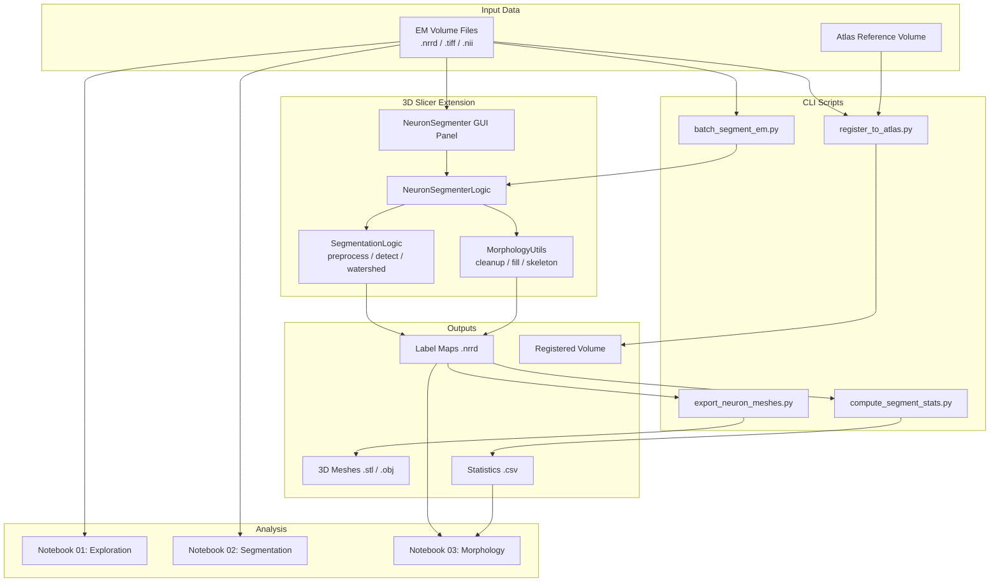
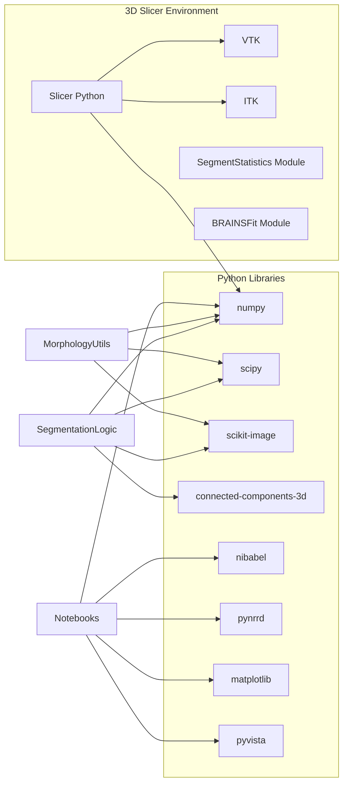

# Architecture Overview

This document describes how the components of the slicer-connectomics-toolkit fit together.

## High-Level Data Flow

## Component Responsibilities

### Extension (`extension/NeuronSegmenter/`)

| File | Role |
|------|------|
| `NeuronSegmenter.py` | Slicer module registration, GUI panel (input selectors, parameter sliders, run button), orchestration |
| `SegmentationLogic.py` | Core algorithm: Gaussian smoothing, CLAHE, membrane thresholding, distance-transform watershed, CC labeling |
| `MorphologyUtils.py` | Post-processing: small-object removal, hole filling, morphological smoothing, skeletonization, sequential relabeling |

The extension is a **scripted loadable module** that registers with Slicer's module system. The GUI (`NeuronSegmenterWidget`) creates Qt widgets via Slicer's `ctk` and `qt` bindings. The logic layer (`NeuronSegmenterLogic`) delegates to the library classes and handles conversion between Slicer nodes and numpy arrays.

### Scripts (`scripts/`)

| Script | Input | Output | Slicer Modules Used |
|--------|-------|--------|---------------------|
| `batch_segment_em.py` | Directory of EM volumes | Label maps (.nrrd) | NeuronSegmenter |
| `export_neuron_meshes.py` | Label map | STL/OBJ meshes | VTK (marching cubes) |
| `compute_segment_stats.py` | Label map + reference volume | CSV statistics | SegmentStatistics |
| `register_to_atlas.py` | Moving + fixed volumes | Registered volume + transform | BRAINSFit |

Scripts are designed to run via `Slicer --python-script` so they have access to Slicer's Python environment, VTK, ITK, and all installed modules.

### Notebooks (`notebooks/`)

| Notebook | Purpose | Key Libraries |
|----------|---------|---------------|
| `01_em_volume_exploration` | Load and visualize EM data | pynrrd, nibabel, matplotlib |
| `02_neuron_segmentation_pipeline` | Step-by-step segmentation walkthrough | scipy, scikit-image, cc3d |
| `03_morphology_analysis` | Quantitative neuron metrics and plots | scikit-image, pandas, matplotlib |

Notebooks run in standard Python (outside Slicer) and reproduce the segmentation logic using the same libraries. They serve as documentation and as standalone analysis tools.

## Dependency Graph

